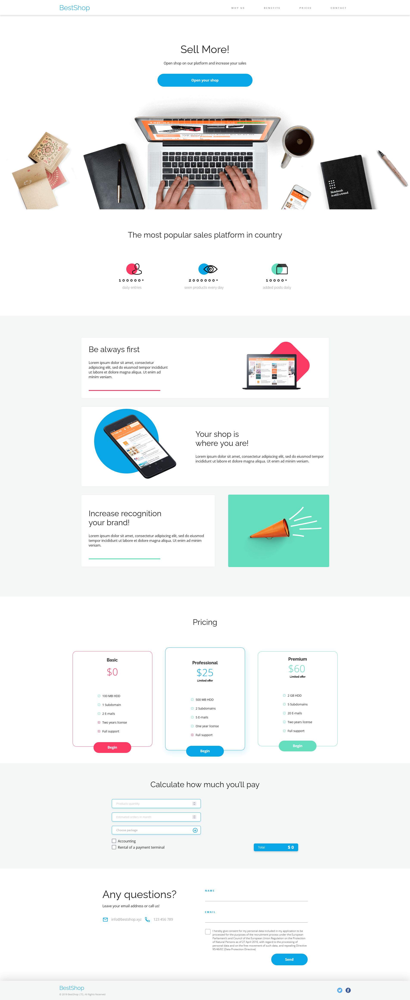
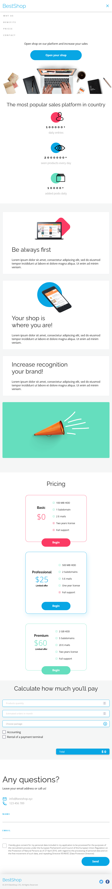

# BestShop Website - workshop

BestShop is a responsive website designed to showcase and promote various products and services. It utilizes modern web technologies such as HTML, SCSS, responsive web design (RWD), JavaScript, and Parcel bundler. The website features a clean and user-friendly interface with sections for navigation, opening, statistics, benefits, pricing, calculation tool, contact information, and a footer.

**Demo:** https://best-shop-workshop.vercel.app/

**Screenshots:**

## Technologies

- HTML
- SCSS
- Responsive Web Design (RWD)
- JavaScript
- Parcel Bundler

## Development Setup

- Clone the repository: git clone https://github.com/yourusername/bestshop.git
- Navigate to the project directory: cd bestshop
- Install dependencies: npm install
- Start the development server: npm start

## Author

The "BestShop" project was designed by CodersLab.

